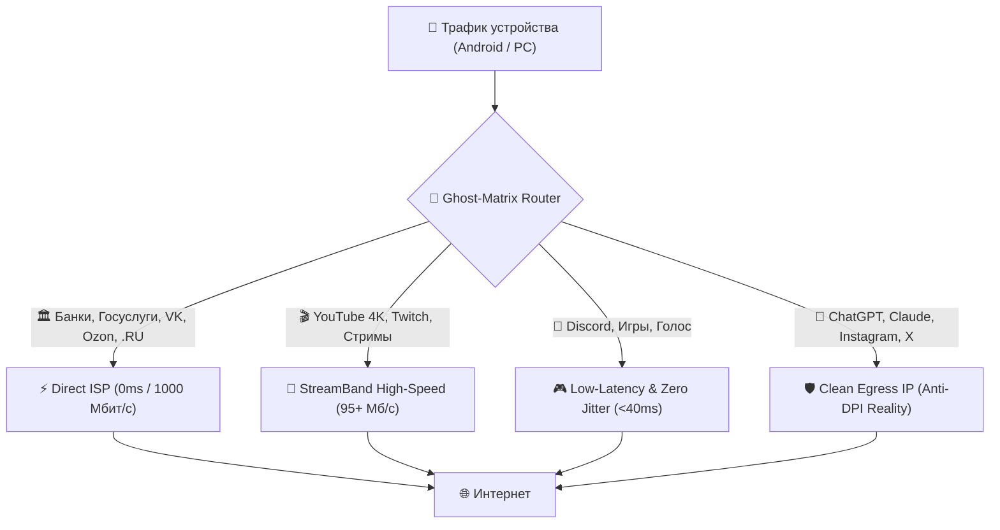

# ⚡ TurboProbe v2.0

<p align="center">
  
  
  
  
</p>

<p align="center">
  <b>Суверенный VPN-клиент нового поколения и ультра-быстрый бенчмарк прокси-сетей для обхода блокировок ТСПУ и белых списков.</b>
</p>

---

## 📡 24/7 Автоматические супер-подписки (Auto-Aggregator)

GitHub Actions каждые 6 часов сканирует десятки проверенных источников (включая GitVerse и российские каналы), дедуплицирует ключи, фильтрует настоящие белые домены (`.ru`, Госуслуги, Сбер, VK, Яндекс) и публикует единые ссылки:

| Категория | Ссылка на подписку (Raw URL) | Описание |
| :--- | :--- | :--- |
| 🛡️ **Анти-Белые списки** | [`sub/anti-whitelist.txt`](https://github.com/SH20FK/TurboProbe/raw/refs/heads/main/sub/anti-whitelist.txt) | **100% настоящие белые SNI против глушения ТСПУ (1200+)** |
| ⚡ **VLESS Reality** | [`sub/reality.txt`](https://github.com/SH20FK/TurboProbe/raw/refs/heads/main/sub/reality.txt) | Неблокируемый VLESS Reality для РФ (3200+) |
| 🌐 **Все протоколы** | [`sub/all.txt`](https://github.com/SH20FK/TurboProbe/raw/refs/heads/main/sub/all.txt) | Объединённый глобальный супер-пул со всего мира (11900+) |
| 🚀 **Hysteria 2 / TUIC** | [`sub/hysteria2.txt`](https://github.com/SH20FK/TurboProbe/raw/refs/heads/main/sub/hysteria2.txt) | Сверхскоростные UDP-протоколы |
| 🔒 **Trojan TLS** | [`sub/trojan.txt`](https://github.com/SH20FK/TurboProbe/raw/refs/heads/main/sub/trojan.txt) | Зашифрованные Trojan TLS ноды |
| 🗝️ **Shadowsocks** | [`sub/shadowsocks.txt`](https://github.com/SH20FK/TurboProbe/raw/refs/heads/main/sub/shadowsocks.txt) | Shadowsocks ноды |
| ⚡ **Clash Meta YAML** | [`sub/clash-meta.yaml`](https://github.com/SH20FK/TurboProbe/raw/refs/heads/main/sub/clash-meta.yaml) | Готовый конфиг с авто-группами |
| 📦 **Base64** | [`sub/base64.txt`](https://github.com/SH20FK/TurboProbe/raw/refs/heads/main/sub/base64.txt) | Универсальная Base64 подписка |

---

## 🧠 Архитектура маршрутизации (Ghost-Matrix)

TurboProbe автоматически разделяет трафик на уровне системы, гарантируя максимальную скорость и доступность всех сервисов одновременно:



---

## 📱 Два режима в одном приложении

Интерфейс TurboProbe v2.0 чётко разделен на 2 независимых экрана в минималистичном стиле Google B&W:

### 1. ⚡ Встроенный VPN-клиент
* **Минимализм WireGuard / Cloudflare 1.1.1.1**: мгновенный Power-переключатель с тактильной отдачей.
* **Карточка сервера и выбор локации**: отображение страны, города, флага и пинга. При тапе открывается шторка с авто-выбором самого быстрого сервера.
* **Телеметрия в реальном времени**: живой спидометр загрузки/отдачи (Мбит/с) и счетчик трафика.
* **Быстрое управление защитой**:
  * `🤖 Ghost-Matrix AI` — интеллектуальное разделение сервисов.
  * `📊 HUD Маршрута` — просмотр DoH 1.1.1.1, IPv6 Blackhole и DPI Bypass статуса.
  * `🛡️ Anti-DPI Щит` — микро-расщепление ClientHello (1-3 байта).
  * `🇷🇺 Smart RU Direct` — прямой доступ для российских сервисов.

### 2. 🧪 Турбо-Чекер & Бенчмарк
* **Массовое сквозное тестирование**: параллельная проверка сотен нод сквозными туннелями с замером пинга, джиттера и устойчивости к ТСПУ.
* **3-уровневое определение страны и провайдера (99.9% точность)**:
  1. *Egress CDN Trace* — парсинг страны (`loc`), города (`colo`) и провайдера (`ASN: Hetzner, DigitalOcean, OVH, Leaseweb, Selectel`).
  2. *Локальный GeoIP & Доменный TLD хоста* — мгновенное распознавание без сетевых задержек.
  3. *Мультиязычный эвристический парсер* — поиск городов и стран на русском и английском языках.
* **Фильтры и сортировки**: мгновенное выделение категорий `Живые`, `ТОП-20`, `YouTube 4K`, `Discord`, `Reality`, `Multi-Hop`.

---

## 📷 Мгновенный QR-импорт и совместимость

TurboProbe поддерживает обмен как отдельными ключами, так и целыми папками подписок:
* Нажмите кнопку **`[ 📱 QR ]`** на любом сервере или в шторке экспорта.
* Наведите камеру в любом совместимом клиенте для мгновенного импорта:
  * 📱 **Happ** / **Incy**
  * 🚀 **v2rayNG** / **Hiddify** / **Streisand**
  * ⚡ **Clash Meta (Mihomo)** / **Sing-Box**
  * 📺 **Android TV**

---

## 🚀 Установка и сборка

### Скачать готовый APK
Скачайте актуальный релиз со страницы [Releases](https://github.com/SH20FK/TurboProbe/releases).

### Сборка из исходников (Flutter)
```bash
# Клонировать репозиторий
git clone https://github.com/SH20FK/TurboProbe.git
cd TurboProbe/app

# Установить зависимости
flutter pub get

# Собрать Release APK
flutter build apk --release
```

---

## 🌐 English Summary

**TurboProbe** is a next-generation sovereign VPN client and ultra-fast proxy benchmark engine designed for high resilience against DPI censorship and whitelist shutdowns:
* **Built-in Native Android VPN Engine** with WireGuard / 1.1.1.1 minimalist aesthetic and split-routing.
* **Ghost-Matrix Smart Routing**: automatically routes YouTube through high-bandwidth nodes, Discord/Gaming through low-jitter nodes, and domestic banking directly at full speed.
* **3-Tier Egress GeoIP & ASN Provider Detection**: determines real server location and hosting company (`Hetzner`, `DigitalOcean`, `OVH`, `Leaseweb`) with 99.9% accuracy.
* **24/7 Automated GitHub Aggregator**: auto-updates clean, deduplicated subscriptions every 6 hours in `sub/`.

---

<p align="center">
  Разработано с ❤️ для свободного и быстрого интернета без цензуры.
</p>
