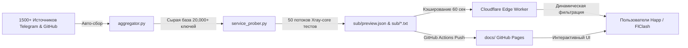

  
  <h1>TurboProbe</h1>
  
<b>Бесплатный VPN — быстро, без регистрации и ограничений</b>

  
Автономный агрегатор и интеллектуальный генератор суверенных VLESS & Reality подписок с глубокой Xray-верификацией

  

    
    
    
  

---

## ⚡ Быстрый старт (Готовые ссылки для импорта)

Вставьте любую из ссылок в ваш VPN-клиент (**Happ**, **FlClash**, **Hiddify**, **v2rayNG**, **v2rayN**, **Clash Verge Rev**):

| Канал / Назначение | Формат | Ссылка на подписку |
| :--- | :---: | :--- |
| 🚀 **Все проверенные узлы (Top Live)** | Edge Worker | https://sub.turboprobe.workers.dev/sub |
| 🧠 **AI & Нейросети (ChatGPT, Claude, Gemini)** | Edge Worker | https://sub.turboprobe.workers.dev/sub/ai |
| 📺 **YouTube 4K & Discord (High Speed)** | Edge Worker | https://sub.turboprobe.workers.dev/sub/youtube |
| 🛡️ **Анти-ТСПУ (VLESS Reality & SNI Bypass)** | Edge Worker | https://sub.turboprobe.workers.dev/sub/anti-tspu |
| ⚔️ **Clash Meta / FlClash (YAML Auto-Best)** | Clash YAML | https://sub.turboprobe.workers.dev/sub/clash |
| 📦 **Резервное зеркало (GitHub Raw)** | Base64 / Plain | https://raw.githubusercontent.com/SH20FK/TurboProbe/main/sub/top50.txt |

> 💡 **Конструктор персональных подписок:** на сайте [sh20fk.github.io/TurboProbe](https://sh20fk.github.io/TurboProbe/) вы можете собрать подписку под свои любимые сервисы и страны (например: ?services=chatgpt,gemini&country=de,nl).

---

## 🌟 Ключевые особенности

- 🛡️ **100% Защита от блокировок ТСПУ и РКН:** приоритет протоколов **VLESS Reality** с валидными публичными ключами (pbk=), **Hysteria 2**, **Trojan TLS** и маскировкой под разрешенные в РФ домены.
- 🔬 **Глубокий Xray-тест реальным трафиком:** каждый сервер проверяется через настоящий локальный HTTP-туннель Xray-core на отдачу трафика к Cloudflare и целевым сервисам. Никаких мертвых «пинг-заглушек».
- 🌍 **Честный GeoIP:** страна и флаг узла определяются строго по исходящему IP-адресу через cloudflare.com/cdn-cgi/trace, игнорируя неверные названия в исходных ссылках.
- ⚡ **Динамическая генерация на Cloudflare Edge Worker:** умный воркер налету фильтрует тысячи узлов по вашим параметрам (country, proto, max_ping, services) со скоростью ответа менее 5 мс.
- 📲 **Импорт в 1 клик:** прямая интеграция протоколов `happ://add/...` и `flclash://install-config...` прямо из веб-интерфейса.

---

## 📱 Рекомендуемые клиенты

| Платформа | Рекомендуемые приложения |
| :--- | :--- |
| 🪟 **Windows** | [FlClash](https://github.com/chen08209/FlClash), [Happ](https://happ.im/), [Hiddify](https://github.com/hiddify/hiddify-next), [v2rayN](https://github.com/2dust/v2rayN), [Clash Verge Rev](https://github.com/clash-verge-rev/clash-verge-rev) |
| 🤖 **Android** | [Happ](https://happ.im/), [FlClash](https://github.com/chen08209/FlClash), [v2rayNG](https://github.com/2dust/v2rayNG), [NekoBox](https://github.com/MatsuriDayo/NekoBoxForAndroid), [Hiddify](https://github.com/hiddify/hiddify-next) |
| 🍏 **iOS / macOS** | [Happ Proxy Utility](https://happ.im/), [Streisand](https://apps.apple.com/app/streisand/id6450534064), [Shadowrocket](https://apps.apple.com/app/shadowrocket/id932747118), [V2Box](https://apps.apple.com/app/v2box-v2ray-client/id6446814049), [Sing-box](https://github.com/SagerNet/sing-box) |
| 🐧 **Linux** | [FlClash](https://github.com/chen08209/FlClash), [Clash Verge Rev](https://github.com/clash-verge-rev/clash-verge-rev), [Nekoray](https://github.com/MatsuriDayo/nekoray) |

---

## 🛠️ Архитектура и Автономность

Проект работает **на 100% автономно** без необходимости постоянного обслуживания:

1. **GitHub Actions Workflow** каждые 6 часов запускает автоматический сборщик из сотен открытых репозиториев и каналов.
2. **Deep Service Prober** поднимает Xray-core и параллельно в 50 потоков отсеивает мертвые ключи.
3. Проверенные ключи выгружаются в GitHub Pages и кэшируются Cloudflare Worker.

---

## 📄 Лицензия & Отказ от ответственности

Проект создан в исследовательских и образовательных целях для анализа доступности сетевых протоколов и тестирования устойчивости туннелирования. Все ключи собраны из открытых публичных источников.
