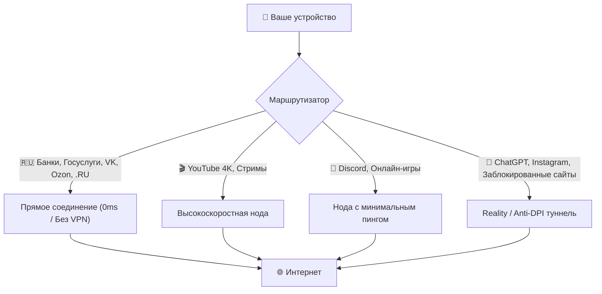

<p align="center">
  <br>
  <b><font size="6">TurboProbe</font></b><br>
  <i>Суверенный VPN-клиент и сверхбыстрый чекер прокси для обхода ТСПУ и белых списков</i>
</p>

<p align="center">
  
  
  
  
  
</p>

---

## 📡 24/7 Авто-подписки (Агрегатор с пре-чекером)

Бот каждые 6 часов собирает ключи из 115+ источников, **проверяет каждый сокетом на доступность** (отсекая все мёртвые серверы) и публикует 100% рабочие сабки:

| Сабка | Ссылка | Для чего |
| :--- | :--- | :--- |
| 🛡️ **Анти-Белые списки** | [`sub/anti-whitelist.txt`](https://github.com/SH20FK/TurboProbe/raw/refs/heads/main/sub/anti-whitelist.txt) | **Только работающие ключи на доменах `.ru`, Госуслуг, Сбера и VK (3 200+ шт)** |
| ⚡ **VLESS Reality** | [`sub/reality.txt`](https://github.com/SH20FK/TurboProbe/raw/refs/heads/main/sub/reality.txt) | Проверенные Reality-ноды против глушения SNI (6 000+ шт) |
| 🌐 **Все протоколы** | [`sub/all.txt`](https://github.com/SH20FK/TurboProbe/raw/refs/heads/main/sub/all.txt) | Полный глобальный пул 100% живых нод со всего мира (29 000+ шт) |
| 🚀 **Hysteria 2 / TUIC** | [`sub/hysteria2.txt`](https://github.com/SH20FK/TurboProbe/raw/refs/heads/main/sub/hysteria2.txt) | Скоростные UDP-протоколы (220+ шт) |
| 🔒 **Trojan TLS** | [`sub/trojan.txt`](https://github.com/SH20FK/TurboProbe/raw/refs/heads/main/sub/trojan.txt) | Зашифрованные Trojan ноды (2 900+ шт) |
| 🗝️ **Shadowsocks** | [`sub/shadowsocks.txt`](https://github.com/SH20FK/TurboProbe/raw/refs/heads/main/sub/shadowsocks.txt) | Классический Shadowsocks (5 000+ шт) |
| ⚡ **Clash Meta** | [`sub/clash-meta.yaml`](https://github.com/SH20FK/TurboProbe/raw/refs/heads/main/sub/clash-meta.yaml) | Готовый конфиг для Mihomo / Clash Verge |
| 📦 **Base64** | [`sub/base64.txt`](https://github.com/SH20FK/TurboProbe/raw/refs/heads/main/sub/base64.txt) | Универсальный формат подписки |

---

## ⚡ Cloudflare Worker Serverless API (`worker/`)

В репозиторий встроен готовый бесплатный **Edge-сервер на Cloudflare Workers** для динамической раздачи подписок с 0ms задержкой:
* **Авто-конвертация формата (User-Agent Sniffing)**:
  * Запрос от **Clash / Mihomo** ➔ автоматически отдаёт чистый `Clash Meta YAML`.
  * Запрос от **Happ / v2rayNG / Hiddify** ➔ отдаёт оптимизированный список сабок с заголовками папок.
  * Запрос из **Браузера** ➔ открывает веб-дашборд с генератором QR-кодов для камеры.
* **Динамические эндпоинты**:
  * `GET /sub/top20` — мгновенная выборка 20 самых быстрых нод.
  * `GET /sub/anti-whitelist` — только российские белые списки.
  * `GET /api/stats` — JSON-телеметрия пула.

```bash
# Развернуть свой бесплатный Edge Worker за 10 секунд:
cd worker
npx wrangler deploy
```

---

## 🧠 Как устроена маршрутизация (Ghost-Matrix)

Приложение само распределяет трафик так, чтобы ничего не тормозило и не ломалось:



---

## 📱 Возможности приложения

### 1. ⚡ VPN-клиент (Android + Windows)
* **Минималистичный дизайн в стиле WireGuard / 1.1.1.1**: один большой тумблер включения с плавной пульсирующей анимацией.
* **Авто-выбор локации**: умный подбор самой быстрой ноды из проверенных.
* **Спидометр в реальном времени**: точный замер скорости загрузки и отдачи прямо в интерфейсе.
* **Модули защиты**:
  * `Ghost-Matrix AI` — раздельная маршрутизация для приложений.
  * `HUD Маршрута` — просмотр DoH 1.1.1.1, IPv6 защиты и статуса DPI.
  * `Anti-DPI Щит` — микро-фрагментация пакетов TLS (1-3B) против замедлений ТСПУ.
  * `Smart RU Direct` — российские сайты открываются напрямую без потери скорости.

### 2. 🧪 Турбо-Чекер
* **Параллельный тест сотен ключей** за пару секунд (TCP + TLS Handshake + Egress CDN Trace).
* **3-уровневое определение страны (99.9% точность)**:
  * Показывает не только страну, но и город с хостинг-провайдером: `🇩🇪 Германия (Франкфурт) · Hetzner`, `🇳🇱 Нидерланды (Амстердам) · DigitalOcean`.
* **Быстрый фильтр**: сортировка по пингу, отбор `ТОП-20`, `YouTube 4K`, `Discord`, `Reality`.

### 3. 📷 QR-код в 1 клик
* Нажмите кнопку **`[ 📱 QR ]`** на любом сервере или в окне экспорта.
* Наведите камеру в **Happ, Incy, v2rayNG, Hiddify, Streisand** или на **Android TV** — и конфиг импортируется моментально.

---

## 🚀 Установка

### Android
Скачайте готовый `.apk` из раздела [Releases](https://github.com/SH20FK/TurboProbe/releases) и установите на телефон.

### Windows
Склонируйте репозиторий и запустите:
```bash
cd app
flutter run -d windows
```
*На Windows при нажатии «Подключить» автоматически настраивается системный системный прокси `127.0.0.1:10808` с прямым доступом для всех `.ru` сайтов.*

---

## 🛠️ Сборка из исходников

```bash
# Клонировать репо
git clone https://github.com/SH20FK/TurboProbe.git
cd TurboProbe/app

# Установить зависимости Flutter
flutter pub get

# Собрать релизный APK
flutter build apk --release
```

---

<p align="center">
  Делитесь сабками и пользуйтесь свободным интернетом! ⚡
</p>
